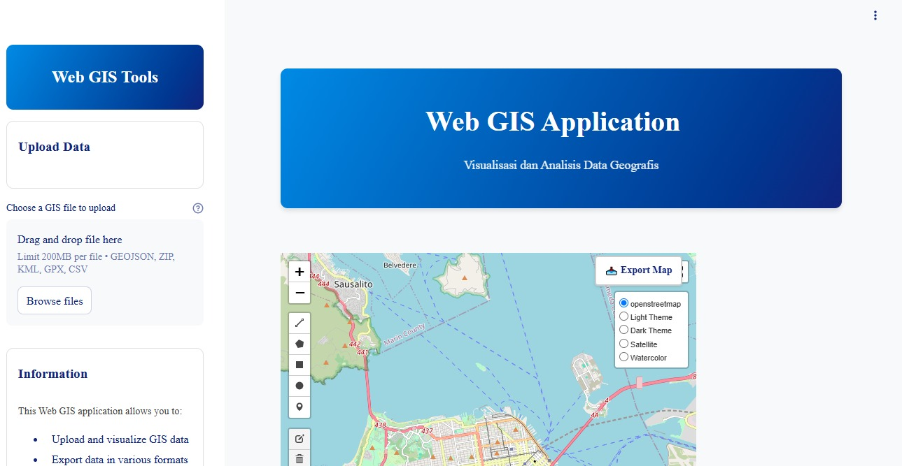

# Web GIS Application

A powerful and user-friendly web-based Geographic Information System (GIS) application built with Streamlit, allowing users to visualize, analyze, and extract geographical data with an intuitive interface.



## Features

- **File Upload & Visualization**: Support for multiple GIS file formats (GeoJSON, Shapefile, KML, GPX, CSV)
- **Interactive Map**: Built with Folium, featuring multiple basemaps, fullscreen mode, and drawing tools
- **Geocoding**: Search and locate addresses and places worldwide
- **Measurement Tools**: Calculate distances and areas on the map
- **Data Extraction**: Extract data from specific areas using drawing tools or existing layers
- **Spatial Analysis**: Perform buffer operations, calculate distances, areas, and more
- **Data Export**: Export data in various formats (GeoJSON, CSV, etc.)
- **Custom Styling**: Enhanced visualization with color gradients and feature highlighting

## Getting Started

### Running the Application

```bash
streamlit run main.py
```

The application will be available at `http://localhost:5000`

### Requirements

This application requires the following Python packages:
- streamlit
- folium
- streamlit-folium
- geopandas
- shapely
- geopy
- requests
- pandas
- branca

## Usage Guide

### Uploading Data

1. Use the sidebar's file uploader to import your GIS data
2. Supported formats include GeoJSON, Shapefile (zipped), KML, GPX, and CSV with coordinates
3. Uploaded data layers will appear on the map and be available for analysis

### Map Navigation

- Use the mouse to pan and zoom
- Toggle between different basemaps (Light, Dark, Satellite, Watercolor)
- Use the fullscreen button for expanded view
- Export the map as an image using the Export Map button

### Geocoding

1. Enter an address or place name in the geocoding panel
2. Click "Search" to locate the address on the map
3. View detailed information about the location

### Measurement Tool

1. Select "Distance" or "Area" measurement type
2. Click on the map to place measurement points
3. View calculated distances or areas in real-time

### Data Extraction

1. Draw a polygon on the map or select an existing polygon layer
2. Choose a source layer to extract data from
3. Extract data and download as GeoJSON or CSV
4. Optionally add extracted data as a new layer

### Spatial Analysis

1. Select the data for analysis
2. Choose an analysis type (Buffer, Distance, Area, etc.)
3. Set parameters for the selected analysis
4. View and export results

## Project Structure

```
├── components/           # UI components
│   ├── analysis_panel.py # Spatial analysis tools
│   ├── data_extraction.py# Data extraction functionality
│   ├── geocoding.py      # Address search functionality
│   ├── info_panel.py     # Information display
│   ├── map_component.py  # Main map rendering
│   ├── measurement_tool.py# Distance/area measurement
│   └── sidebar.py        # Sidebar with upload controls
├── utils/                # Utility functions
│   ├── export_handler.py # Data export functionality
│   ├── file_handler.py   # File upload processing
│   ├── geo_processing.py # Geometry processing
│   └── spatial_analysis.py # Analysis algorithms
└── main.py               # Main application
```

## Contributing

Contributions to improve the application are welcome. Please feel free to fork the repository and submit pull requests.

## License

This project is licensed under the MIT License.
Jika butuh repo ini silahkan email : habizinnia@gmail.com
